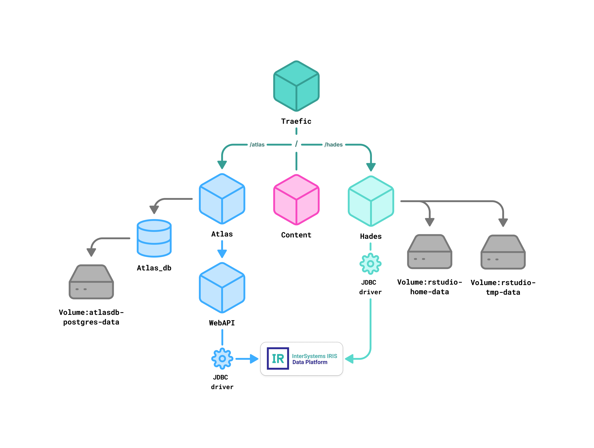
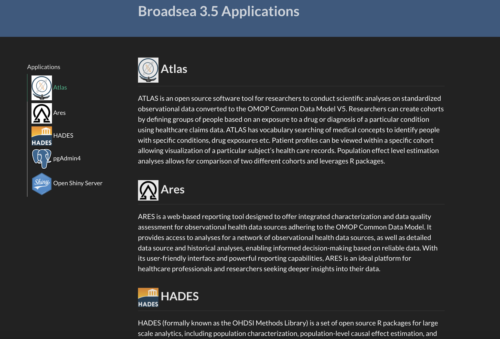
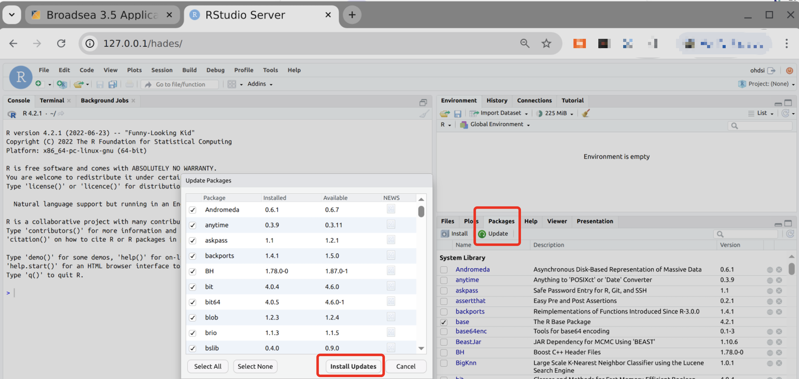

# Instructions for Integrating OHDSI/Broadsea with the InterSystems IRIS Data Platform

## Summary
This document provides step‑by‑step instructions for installing InterSystems IRIS, deploying the OHDSI Broadsea tool‑stack, and connecting the two platforms. It is intended for engineers or data scientists who need a reproducible procedure that works on Linux, macOS, or Windows (via Docker). Screenshots referenced in the original draft are preserved; if you are viewing this in a text‑only context, follow the descriptive captions instead.

### Prerequisites
- Hardware  4 CPU, 8 GB RAM minimum (16 GB recommended)
- Operating System — Linux or macOS; Windows users should run InterSystems IRIS in Docker.
- Docker Desktop  Required for container‑based deployment.
- Git -  For cloning Broadsea.
- Java 17+  Needed by several OHDSI components.
- Internet access  To pull images, drivers, and R packages.

#### Minimum versions
Minimum versions – InterSystems IRIS 2024.3 (most features work on 2024.1.3); SqlRender 2.1.1 (next release); WebAPI 2.13.1 (PR #1234); OHDSI R packages – latest versions from the OHDSI GitHub repository. These packages are automatically downloaded and installed as part of the OHDSI Broadsea setup process.

## Installing InterSystems IRIS for Health natively (available for macOS / Linux)

All examples use InterSystems IRIS for Health 2025.1 Community Edition unless stated otherwise. The same commands work on an Enterprise license by substituting the image/tag.
Download the community edition from [InterSystems WRC](https://wrc.intersystems.com/wrc/Login.csp?Local=1) (Actions → Online Distribution → InterSystems IRIS or IRISHealth). Make sure you are using IRISHealth_Community-2024.3 version or later.

Open a terminal and execute:
```
# use the directory with IRISHealth file
cd ~/Downloads/IRISHealth_Community-2024.3.0.217.0-macos

# Make the irisinstall installation file executable:
chmod +x irisinstall

# Run the installation:
sudo ./irisinstall

# After installation is complete, run the command verify the service is running (“Status = running”):
iris list
```

Additional steps to perform in the terminal during installation:
- **Instance name** — keep the default IRISHEALTH unless you need multiple instances.
- **Destination directory** — absolute path beginning with /.
- **Installation type** — choose Development unless you have a server‑only use‑case.
- **Owner user** — your current OS username (whoami).

### Managing the InterSystems IRIS Service
During the installation of the application, you may need to configure other settings:
```
# status check to verify the service is running (“Status = running”)
iris list

#Launching the application
iris start IRISHEALTH

# Stop the application
iris stop IRISHEALTH
```
Access the Management Portal at http://localhost:52773/csp/sys/UtilHome.csp after the service is running.
For more detailed instructions, please refer to the official InterSystems [documentation](https://docs.intersystems.com/iris20251/csp/docbook/Doc.View.cls?KEY=PAGE_deployment_install).

### Running InterSystems IRIS for Health in Docker (recommended)
*Note for Windows users: It is recommended to run IRIS inside a container (e.g., using Docker), as this approach ensures easier setup, better compatibility, and improved isolation from the host system.*

Find the latest tag on [Docker Hub](https://hub.docker.com/r/intersystems/iris-community).  For further details on how to run InterSystems IRIS for Health in Containers visit [Intersystems Documentation](https://docs.intersystems.com/iris20251/csp/docbook/DocBook.UI.Page.cls?KEY=ADOCK)

Execute:
```
docker run --name my-iris -d -v dbvolume:/durable intersystems/iris-community:2025.1

docker exec -u root my-iris chown -R irisowner:irisowner /durable

docker container rm -f my-iris

docker run --name my-iris -d --publish 1972:1972 --publish 52773:52773 -v dbvolume:/durable --env ISC_DATA_DIRECTORY=/durable/iris intersystems/iris-community:2025.1
```

Browse to **http://127.0.0.1:52773/csp/sys/UtilHome.csp** and log in with the default account (_SYSTEM / SYS), then set a strong password.
For custom [volumes](https://docs.docker.com/engine/storage/volumes/), entry‑points, or ARM images see the official [Docker guide](https://docs.docker.com/manuals/).


## Deploying OHDSI Broadsea and Connecting to InterSystems IRIS

*Fig. 1. OHDSI Broadsea Deployment Architecture*

This section provisions the full OHDSI tool‑chain (ATLAS, WebAPI, HADES, etc.) using the official [Broadsea repository](https://www.ohdsi.org/wp-content/uploads/2023/10/Londhe-Ajit_Broadsea-3.0-BROADening-the-ohdSEA_2023symposium-Ajit-Londhe.pdf).

1. Clone Broadsea:
```
git clone https://github.com/OHDSI/Broadsea.git
```  
**Perform all further actions inside the newly created Broadsea directory.**

2. Edit .env file inside the cloned  repo:  
*Note: The .env file is hidden by default:*
- On macOS, press Cmd + Shift + . in Finder, or use ls -a in the terminal.
- On Windows, enable “Hidden items” in the View tab of File Explorer, or use dir /a in Command Prompt.
 ```
- WEBAPI_GITHUB_URL="https://github.com/OHDSI/WebAPI.git#rc-2.13.0"
- DOCKER_ARCH="linux/amd64"
- WEBAPI_ADDITIONAL_JDBC_FILE_PATH="../jdbc/none.jar"

+ WEBAPI_GITHUB_URL="https://github.com/OHDSI/WebAPI.git#master"
+ DOCKER_ARCH="linux/arm64"  # Only for mac with apple silicon
+ WEBAPI_ADDITIONAL_JDBC_FILE_PATH="../jdbc/intersystems-jdbc-3.10.3.jar"
```

3. Update the broadsea-hades service block in docker-compose.yml file inside the cloned  repo:  
   *Note: ONLY on macOS with apple silicon chip!*
```
 broadsea-hades:
   image: rocker/rstudio:4.3.1
   platform: "linux/arm64"
```

4. Download the InterSystems JDBC driver (v 3.10.3) from Maven Central  to “ jdbc”  directory  in  the project.
Or use command:
 ```
#run this command also inside the project directory
curl -o ./jdbc/intersystems-jdbc-3.10.3.jar https://repo1.maven.org/maven2/com/intersystems/intersystems-jdbc/3.10.3/intersystems-jdbc-3.10.3.jar
```
*We have to download the JDBC driver manually, since it is required for WebAPI. You can see in Fig.1 that WebAPI uses a driver to connect to IRIS.*

5. Start Broadsea:
 ```
# make sure you are running docker-compose in the correct directory that contains docker-compose.yml
docker-compose --env-file .env --profile webapi-from-git --profile content --profile hades --profile atlasdb --profile atlas-from-image up -d
```

6. Install Java + developer libraries in HADES container:  
*Note: ONLY on macOS with apple silicon chip!*
```
docker exec -it broadsea-hades bash
apt-get update && apt-get install -y default-jdk r-base-dev liblzma-dev libbz2-dev unixodbc-dev libpq-dev libssl-dev libssh-dev libcurl4-openssl-dev libxml2-dev libgit2-dev build-essential
exit
```

7. Copy the JDBC driver into the HADES container: 
 ```
#run this command also inside the project directory
docker exec -it broadsea-hades bash
mkdir -p /opt/hades/jdbc_drivers
exit
docker cp ./jdbc/intersystems-jdbc-3.10.3.jar broadsea-hades:/opt/hades/jdbc_drivers/
```
*Note: This step is temporary and will no longer be required once [OHDSI/Hades pull request #33](https://github.com/OHDSI/Hades/pull/33) is merged.
Alternatively run DatabaseConnector::downloadJdbcDrivers(\"iris\") inside RStudio to fetch the driver automatically (this can be done during hades preparation)*

8. Register InterSystems IRIS as a data‑source in Postgres (WebAPI).
Create a new file named 200_populate_iris_source_daimon.sql and add the following SQL content (you can see this example script from the Broadsea repository for reference). Be sure to replace **%LOGIN%** and **%PASSWORD%** with your actual IRIS credentials:  
*Note: On macOS use VS Code or another IDE instead of TextEdit. TextEdit can add invisible formatting that breaks scripts*
 ```
DELETE FROM webapi.source_daimon WHERE source_daimon_id NOT IN (1, 2, 3);
DELETE FROM webapi.source WHERE source_id NOT IN (1);
INSERT INTO webapi.source(source_id, source_name, source_key, source_connection, source_dialect)
VALUES (2, 'my-iris', 'IRIS', 'jdbc:IRIS://host.docker.internal:1972/USER?user=%LOGIN%&password=%PASSWORD%', 'iris');
INSERT INTO webapi.source_daimon( source_daimon_id, source_id, daimon_type, table_qualifier, priority) VALUES (4, 2, 0, 'OMOPCDM54', 0);
INSERT INTO webapi.source_daimon( source_daimon_id, source_id, daimon_type, table_qualifier, priority) VALUES (5, 2, 1, 'OMOPCDM54', 10);
INSERT INTO webapi.source_daimon( source_daimon_id, source_id, daimon_type, table_qualifier, priority) VALUES (6, 2, 2, 'OMOPCDM54_RESULTS', 0);
``` 
9. Loading 200_populate_iris_source_daimon.sql into the database:
```
docker cp 200_populate_iris_source_daimon.sql broadsea-atlasdb:/docker-entrypoint-initdb.d/200_populate_iris_source_daimon.sql
docker exec -it broadsea-atlasdb psql -U postgres -f "/docker-entrypoint-initdb.d/200_populate_iris_source_daimon.sql"
```
10. Allow incoming connections through the system firewall (on Windows ONLY):  
    *Control Panel → System and Security → Windows Defender Firewall → Advanced settings → Inbound Rules → New Rule → Type: Port → TCP → Port: `<your port>` → Allow the connection*

11. Temporary patch ([until upstream PR merges](https://github.com/intersystems-community/OHDSI-SqlRender/commit/0c6f068755083f9ec7479ed5038e5bcc0cc3d354)) — download and replace replacementPatterns.csv in the HADES container:
 ```
# find the container ID of ohdsi/broadsea-hades 
docker ps

# Copy the file to the container. Specify the path to the file you downloaded from the PR and container_id
docker cp "/your_path/to/replacementPatterns.csv" <container_id>:/usr/local/lib/R/site-library/SqlRender/csv/replacementPatterns.csv
```
    
12. Restart  the affected container via the Docker Desktop UI.
Once all containers are healthy, open http://127.0.0.1 to access ATLAS and other services.

*Fig. 2. Applications in OHDSI/Broadsea*

## Preparing HADES (RStudio Server)

#### Verify your connection is working from R:
1. Go to Hades page http://127.0.0.1/hades:
- Login: ohdsi
- Password: mypass 

2. Run the commands in RStudio:
```
# this command should be run ONLY on macOS with apple silicon chip!
Sys.setenv(JAVA_HOME = "/usr/lib/jvm/default-java")
install.packages("rJava")

# this command should be run ONLY on macOS with apple silicon chip!
if (!requireNamespace("remotes", quietly = TRUE)) {install.packages("remotes")}

#install the recommended version (commit-specific) of DatabaseConnector
tryCatch({remotes::install_github("OHDSI/DatabaseConnector@7968375593dc7e030c7cc243d9f52828c6cc94bc", upgrade = "never", dependencies = TRUE)}, error = function(e) {stop("Cannot continue without DatabaseConnector: ", conditionMessage(e))})

library(DatabaseConnector)

# load & configure connection to Iris, if it doesn't work, restart the R session
connectionDetails <- DatabaseConnector::createConnectionDetails( dbms = "iris", server = "host.docker.internal", user = "yourUsername", password = "yourpwd", pathToDriver = "/opt/hades/jdbc_drivers")

tryCatch({conn <- DatabaseConnector::connect(connectionDetails); message("Connected to IRIS")}, error = function(e) {stop("Connection failed — ensure JDBC driver is in /opt/hades/jdbc_drivers")})
```

3. Update R packages from the Packages tab. Click Update in RStudio’s Packages panel.

*Fig. 3. Packages in Rstudio*

4. [Load your dataset into the OMOP CDM 5.4 schema in IRIS.](#loading-data-into-intersystems-iris-optional)  

5. Run Achilles (make sure the CDM tables are populated with your data before running Achilles).  
Run code in RStudio:
```
# Please check first that you have a created schema for the calculation results (OMOPCDM54_RESULTS below)
install.packages("xml2")
remotes::install_github("OHDSI/ParallelLogger")
remotes::install_github("OHDSI/Achilles")
library(Achilles)
achilles(
    connectionDetails = connectionDetails,
    cdmDatabaseSchema = "OMOPCDM54", 
    resultsDatabaseSchema = "OMOPCDM54_RESULTS",
    vocabDatabaseSchema = "OMOPCDM54",
    cdmVersion = "5.4",
    sourceName = "IRIS local test",
    createTable = TRUE,
    smallCellCount = 5 )
```
After Achilles runs successfully you will see dashboards populated in ATLAS.  

*Note! Before re-running Achilles on the same dataset, make sure to clean up the temporary classes (tables) it generates in the results schema in IRIS. Or create a new result schema to avoid conflicts.*

## Loading Data into InterSystems IRIS (OPTIONAL)
This section reviews practical pathways for bringing OMOP Common Data Model (CDM) content into an InterSystems IRIS instance—whether that instance runs locally, in Docker, or in the InterSystems Cloud. Choose the approach that best matches your environment and data‑volume profile.

### Using InterSystems Cloud
If you do not yet have an InterSystems IRIS environment, you can spin up a fully managed cloud instance (including a sample CDM dataset) at [INTERSYSTEMS CLOUD SERVICES PORTAL](https://portal.preview.isccloud.io/account/signup) 
You can find detailed information about Cloud Certificates at the [link](https://docs.intersystems.com/services/csp/docbook/Doc.View.cls?KEY=ICS_reference). 

### Initializing the CDM Schema
Before any rows can be inserted, the target database must expose the full set of OMOP tables, constraints, and indexes.
In HADES (RStudio Server), call **CommonDataModel::executeDdl()**, pointing it at your InterSystems IRIS connection. The function executes the official DDL for the requested CDM version, guaranteeing structural compatibility with downstream tooling such as Achilles and ATLAS.
*Tip: If you do not yet have an InterSystems IRIS environment, you can spin up a fully managed cloud instance (including a sample CDM dataset) at https://portal.preview.isccloud.io/account/signup.*

### Note Vocabulary Size Constraints
Depending on your dataset, you may need to download additional vocabularies separately. These can be obtained from the official OMOP vocabulary repository at [https://athena.ohdsi.org](https://athena.ohdsi.org). To do this, register or log in, go to the *“Download”* section (Fig. 4), select the vocabularies relevant to your use case, and generate a download package.

*Fig. 4. Standardized Vocabularies in Athena*

The Community Edition cannot store the full Athena vocabulary set. The following vocabularies are typically sufficient: ICD10CM, ICD9CM, ICD9Proc, CPT4, HCPCS, NDC, RxNorm, RxNorm Extension, SNOMED, LOINC, Visit Type, Drug Type, Procedure Type, Condition Type, Observation Type, Death Type, Note Type, Measurement Type, Device Type, Cohort Type, Gender, Race, Ethnicity, Domain, Relationship, Vocabulary, Concept Class, CDM, Type Concept, UCUM.

Before loading the vocabularies into the database, you need to unzip the vocabulary archive you received from Athena into a convenient directory on your local machine. This directory will be referred to as vocabPath in the code examples below. It should contain CSV files such as CONCEPT.csv, VOCABULARY.csv, RELATIONSHIP.csv, and others. Make sure the path you provide in the code matches the location of the unzipped files.

Example:
```
# Make sure the connection to IRIS is established and stored in 'conn'
library(VocabularyDownloader)
insertVocabularyFromCsv(
  connection = conn,
  vocabPath = "~/Downloads/vocab",  # Path to the unzipped vocabulary files
  cdmDatabaseSchema = "OMOPCDM54"   # Or use "OMOPCDM53" if your schema is v5.3
)
```

### Loading the Eunomia Test Dataset (OMOP CDM 5.3)
Eunomia is a standard dataset manager for sample OMOP (Observational Medical Outcomes Partnership) Common Data Model (CDM) datasets. The full [OHDSI instruction is available here]
(https://github.com/OHDSI/Eunomia).
To upload Eunomia in RStudio you can use this code:
```
# Make sure the connection to IRIS is established and stored in 'conn'
remotes::install_github("OHDSI/CommonDataModel")
remotes::install_github("OHDSI/Eunomia")
library(Eunomia)
eunomiaDetails <- Eunomia::getEunomiaConnectionDetails()
eunomiaConn <- DatabaseConnector::connect(eunomiaDetails)
irisConn <- conn
irisSchema <- "OMOPCDM53"
cdmTables <- DatabaseConnector::getTableNames(eunomiaConn)
for (tableName in cdmTables) {
    message("Table: ", tableName)
    df <- DatabaseConnector::querySql(eunomiaConn, paste0("SELECT * FROM ", tableName))
    DatabaseConnector::insertTable(
      connection = irisConn,
      tableName = paste0(irisSchema, ".", tableName),
      data = df,
      dropTableIfExists = TRUE,
      createTable = TRUE,
      tempTable = FALSE)}
```
That's it! Now you can use the full capabilities of OHDSI tools
